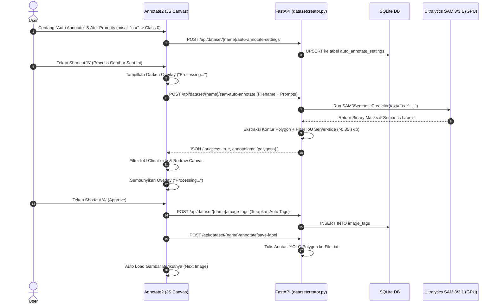

# Arsitektur & Alur Kerja Sistem (System Flow)

Dokumen ini menjelaskan arsitektur sistem dan alur kerja antara backend **FastAPI** (`datasetcreator.py`), basis data **SQLite** (`dataset_manager.db`), komponen frontend SPA (`annotate2.html`, `annotate2.js`), serta pipeline AI **SAM 3 / SAM 3.1** (Ultralytics).

---

## 🏛️ 1. Arsitektur Komponen Utama

- **Backend (`datasetcreator.py`)**: REST API server berbasis FastAPI & Uvicorn. Bertanggung jawab atas pengelolaan file dataset fisik, penyimpanan data tag/settings di SQLite, serta pemrosesan model inferensi AI GPU/CUDA.
- **Database (`dataset_manager.db`)**: 
  - `tags`: Master tag global.
  - `image_tags`: Asosiasi tag per gambar per dataset.
  - `auto_annotate_settings`: Konfigurasi model SAM, daftar prompt-to-class mapping, dan tag otomatis.
- **Frontend Editor (`annotate2.html` / `annotate2.js`)**: Editor anotasi interaktif berbasis HTML5 Canvas 2D yang mendukung:
  - Bounding Box (B) & Polygon (P) manual
  - Magic Selection (M) point-to-segment
  - Auto Annotate (S = Process, A = Approve) berbasis text prompt SAM 3/3.1 dengan IoU deduplication

---

## 📊 2. Diagram Alur Sistem (Overall System Flowchart)

```mermaid
flowchart TD
    %% Subgraphs & Components
    subgraph Client ["Frontend Browser (HTML/JS)"]
        UI_Nav["Main Navigation (index.html / index.js)"]
        Tab_DS["Dataset Tab (dataset.html)"]
        Tab_Class["Class Settings (class.html)"]
        Tab_Ann2["Annotate2 Canvas (annotate2.html / annotate2.js)"]
        
        subgraph Ann2_Tools ["Annotate2 Features"]
            Manual_Tool["Manual BBox / Polygon Tools"]
            Magic_Tool["Magic Selection (M)\nPoint Prompt"]
            Auto_Tool["Auto Annotate (S / A)\nText Prompt SAM3/3.1"]
            Auto_Settings["Auto Annotate Settings Panel"]
        end
    end

    subgraph Server ["Backend (datasetcreator.py - FastAPI)"]
        API_Static["Static SPA Server"]
        API_DS["Dataset File Manager"]
        API_Tag["Tag & DB Manager"]
        API_SAM_Predict["SAM 3 Point Predictor\n(/sam-predict)"]
        API_SAM_Auto["SAM 3.1 Semantic Predictor\n(/sam-auto-annotate)"]
        IoU_Filter["IoU Deduplication Engine\n(Threshold > 0.85)"]
    end

    subgraph Storage ["Physical Storage & AI Models"]
        DB[("SQLite Database\ndataset_manager.db")]
        DS_Files[/"Dataset Storage\ndataset/{name}/data.yaml\nimages/ & labels/"/]
        SAM_Weights[/"Model Weights\nsam3.pt / sam3.1.pt\n(GPU CUDA)"/]
    end

    %% Client UI Connections
    UI_Nav --> Tab_DS
    UI_Nav --> Tab_Class
    UI_Nav --> Tab_Ann2

    Tab_Ann2 --> Manual_Tool
    Tab_Ann2 --> Magic_Tool
    Tab_Ann2 --> Auto_Tool
    Tab_Ann2 --> Auto_Settings

    %% Client to Server API interactions
    Tab_DS -- "Fetch & CRUD Datasets / Images" --> API_DS
    Tab_Class -- "Update Class Config" --> API_DS
    Tab_Class -- "Manage Tags" --> API_Tag
    
    Auto_Settings -- "Save/Load Settings" --> API_Tag
    
    Magic_Tool -- "POST /sam-predict (x,y points)" --> API_SAM_Predict
    Auto_Tool -- "POST /sam-auto-annotate (text prompts)" --> API_SAM_Auto

    %% Server to DB & File System
    API_DS <--> DS_Files
    API_Tag <--> DB
    
    API_SAM_Predict <--> SAM_Weights
    API_SAM_Auto <--> SAM_Weights

    %% Auto Annotate Execution Flow
    API_SAM_Auto --> IoU_Filter
    IoU_Filter -- "Return Non-duplicate Polygons" --> Auto_Tool

    %% Shortcuts Actions in Canvas
    subgraph Canvas_Action ["Auto-Annotate Shortcuts Flow"]
        S_Key["Shortcut S (Process)"] --> Run_Auto["Request SAM Text Prompt Segmentation"]
        Run_Auto --> Render_Mask["Render Polygons to Canvas"]
        A_Key["Shortcut A (Approve)"] --> Apply_Tags["Apply Auto Tags"]
        Apply_Tags --> Save_Label["Save Anotasi ke File .txt"]
        Save_Label --> Next_Img["Move to Next Image"]
    end

    Auto_Tool -. Executes .-> Canvas_Action
```

---

## 🔄 3. Diagram Alur Eksekusi Auto-Annotate (Sequence Diagram)

