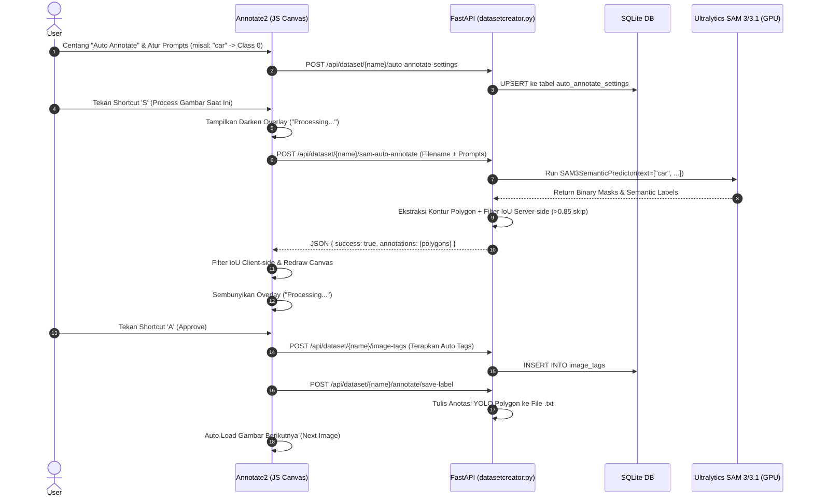

# Arsitektur & Alur Kerja Sistem (System Flow)

Dokumen ini menjelaskan arsitektur sistem dan alur kerja antara backend **FastAPI** (`datasetcreator.py`), basis data **SQLite** (`dataset_manager.db`), komponen frontend SPA (`annotate2.html`, `annotate2.js`), serta pipeline AI **SAM 3 / SAM 3.1** (Ultralytics).

---

## 🏛️ 1. Arsitektur Komponen Utama

- **Backend (`datasetcreator.py`)**: REST API server berbasis FastAPI & Uvicorn. Bertanggung jawab atas pengelolaan file dataset fisik, penyimpanan data tag/settings di SQLite, serta pemrosesan model inferensi AI GPU/CUDA.
berbasis HTML5 Canvas 2D yang mendukung:
  - Bounding Box (B) & Polygon (P) manual
  - Magic Selection (M) point-to-segment
  - Auto Annotate (S = Process, A = Approve) berbasis text prompt SAM 3/3.1 dengan IoU deduplication

---

## 🔄 2. Diagram Alur Eksekusi Auto-Annotate (Sequence Diagram)

---

## 🎨 3. Pembaruan Panel Auto Annotate Settings (Floating Draggable Window)

Untuk meningkatkan kenyamanan alur kerja anotasi, panel pengaturan Auto Annotate diubah dari modal dialog tengah layar dengan backdrop gelap menjadi **Window Melayang (Floating Panel)** yang selalu terlihat saat mode aktif dan dapat digeser-geser.

### 📌 Fitur Utama:
- **Always Visible & Non-blocking**: Panel tidak lagi menghalangi kanvas utama dengan overlay gelap. User tetap dapat melihat gambar dan melakukan anotasi manual atau menekan shortcut `S` / `A` selagi panel pengaturan terbuka.
- **Draggable Handle**: Panel dapat digeser secara mulus menggunakan drag handle pada header bar (menggunakan mouse drag tracking yang di-clamp ke dalam batas viewport agar tidak keluar dari layar).
- **State Management & Dirty Tracking**:
  - Tombol **Simpan Settings** hanya akan aktif (`enabled`) jika terdeteksi adanya perubahan input prompt, perubahan relasi class select, model select, ataupun auto-tags.
  - Tombol **Batalkan Perubahan** akan membatalkan seluruh perubahan yang belum disimpan dan mengembalikan konfigurasi panel ke snapshot konfigurasi server terakhir.
  - Setelah berhasil melakukan penyimpanan, status panel kembali bersih (`clean`) dan tombol simpan dinonaktifkan kembali.

