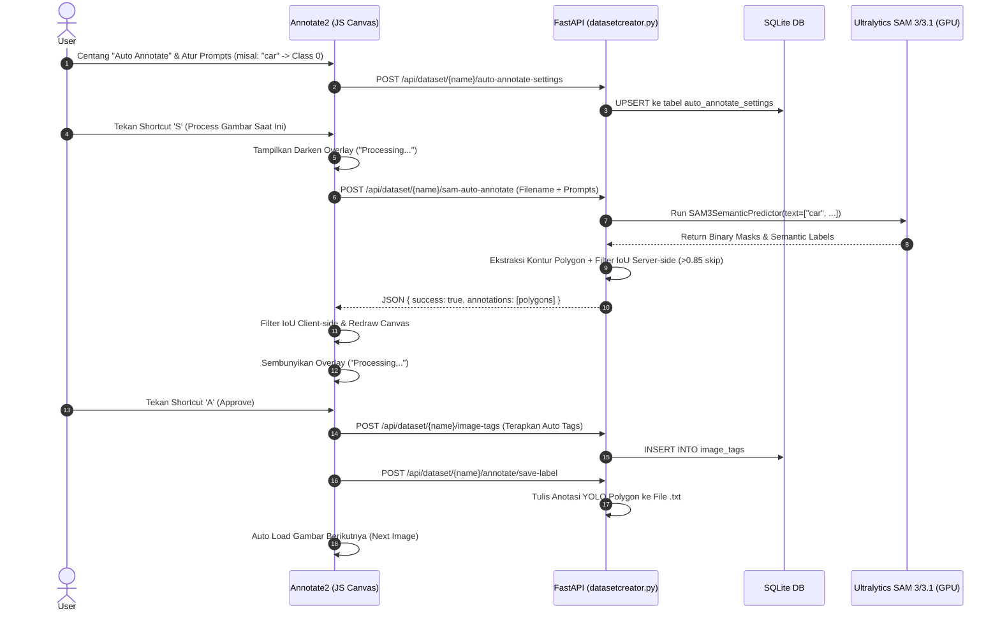

# Arsitektur & Alur Kerja Sistem (System Flow)

Dokumen ini menjelaskan arsitektur sistem dan alur kerja antara backend **FastAPI** (`datasetcreator.py`), basis data **SQLite** (`dataset_manager.db`), komponen frontend SPA (`annotate2.html`, `annotate2.js`), serta pipeline AI **SAM 3 / SAM 3.1** (Ultralytics).

---

## 🏛️ 1. Arsitektur Komponen Utama

- **Backend (`datasetcreator.py`)**: REST API server berbasis FastAPI & Uvicorn. Bertanggung jawab atas pengelolaan file dataset fisik, penyimpanan data tag/settings di SQLite, serta pemrosesan model inferensi AI GPU/CUDA.
berbasis HTML5 Canvas 2D yang mendukung:
  - Bounding Box (B) & Polygon (P) manual
  - Magic Selection (M) point-to-segment
  - Auto Annotate (S = Process, A = Approve) berbasis text prompt SAM 3/3.1 dengan IoU deduplication

---

## 🔄 2. Diagram Alur Eksekusi Auto-Annotate (Sequence Diagram)

---

## 🎨 3. Pembaruan Panel Auto Annotate Settings (Floating Draggable Window)

Untuk meningkatkan kenyamanan alur kerja anotasi, panel pengaturan Auto Annotate diubah dari modal dialog tengah layar dengan backdrop gelap menjadi **Window Melayang (Floating Panel)** yang selalu terlihat saat mode aktif dan dapat digeser-geser.

### 📌 Fitur Utama:
- **Always Visible & Non-blocking**: Panel tidak lagi menghalangi kanvas utama dengan overlay gelap. User tetap dapat melihat gambar dan melakukan anotasi manual atau menekan shortcut `S` / `A` selagi panel pengaturan terbuka.
- **Draggable Handle**: Panel dapat digeser secara mulus menggunakan drag handle pada header bar (menggunakan mouse drag tracking yang di-clamp ke dalam batas viewport agar tidak keluar dari layar).
- **State Management & Dirty Tracking**:
  - Tombol **Simpan Settings** hanya akan aktif (`enabled`) jika terdeteksi adanya perubahan input prompt, perubahan relasi class select, model select, ataupun auto-tags.
  - Tombol **Batalkan Perubahan** akan membatalkan seluruh perubahan yang belum disimpan dan mengembalikan konfigurasi panel ke snapshot konfigurasi server terakhir.
  - Setelah berhasil melakukan penyimpanan, status panel kembali bersih (`clean`) dan tombol simpan dinonaktifkan kembali.

---

## 🖐️ 4. Aksesibilitas Navigasi & Magic Selection (Replace Mode Enhancement)

Untuk meningkatkan kecepatan dan keakuratan interaksi pengguna saat menggunakan editor:

### 1. Middle-Click Drag Canvas (Pan) pada Semua Mode
- Sekarang pengguna dapat melakukan **klik tengah mouse (Middle Mouse Button)** lalu menggeser mouse (drag) untuk menggeser canvas (pan/drag canvas) di **seluruh mode** anotasi (BBox, Polygon, Edit, Magic, dll).
- Hal ini menghilangkan keharusan berpindah ke mode Hand/Drag (shortcut `H`) terlebih dahulu hanya untuk menggeser gambar, sehingga proses pelabelan menjadi jauh lebih cepat.

### 2. Efek Gelap 50% (Dimming Overlay) saat Shift+Hover di Mode Magic (M)
- Pada mode Magic Selection (M), ketika pengguna menahan tombol **Shift** untuk memilih anotasi yang ingin diganti (Replace Mode), canvas akan meredup **50% (gelap)**.
- Hanya anotasi yang sedang diarahkan oleh kursor (hover) atau sedang dijadikan target penggantian yang tetap terang benderang.
- Efek visual ini sama seperti di mode Edit (E), memberikan fokus penuh pada area yang sedang diganti.

---

## 🤖 5. Alur Kerja Baru Auto Annotate (Checked vs Unchecked Mode)

Checkbox **Auto Annotate** kini bertindak sebagai pengatur mode eksekusi ketika berada di alat Auto Annotate:

### 1. Mode Loop Otomatis (Checkbox Dicentang / Aktif)
- **Shortcut `S`**: Melakukan deteksi (scan), otomatis menyimpan hasil anotasi (`Save`), menerapkan auto-tags, memuat gambar berikutnya (`Next Image`), dan secara rekursif memproses gambar baru tersebut secara otomatis.
- Cocok digunakan untuk dataset berskala besar yang memiliki konfigurasi prompt yang sudah sangat akurat.

### 2. Mode Scan Preview (Checkbox Tidak Dicentang / Nonaktif)
- Pengguna tetap berada pada alat Auto Annotate, namun sistem tidak langsung menyimpan hasil deteksi.
- **Shortcut `S`**: Melakukan pemindaian (scan) dan menampilkan **polygon sementara (preview)** berupa garis putus-putus.
- **Shortcut `Enter`**: Mengonfirmasi dan menyimpan semua polygon sementara yang tampil ke daftar anotasi permanen (menggantikan shortcut `A` sebelumnya).
- **Shortcut `Esc`**: Membatalkan pemindaian dan menghapus semua preview polygon sementara pada kanvas.
- Cocok digunakan untuk memverifikasi atau menyeleksi hasil SAM sebelum disimpan secara permanen.

---

## ?? 6. Threshold Conf & IoU di Settings Panel + Toggle IoU-Rejected

### 6.1 Slider Conf & IoU di Settings Panel
Panel **Auto Annotate Settings** kini memiliki dua slider di bagian paling atas (Detection Thresholds):
- **Conf** (default: 25%) � Threshold minimum confidence score SAM. Semakin tinggi = semakin sedikit tapi lebih akurat.
- **IoU** (default: 85%) � Threshold IoU deduplication. Anotasi baru yang overlap >= nilai ini dianggap duplikat.
- Disimpan ke server dan dikirim ke API sam-auto-annotate (field conf) serta digunakan sebagai threshold client-side.

### 6.2 Toggle IoU di Toolbar Header
- Tombol **IoU** (merah) di sebelah tombol Settings. Klik untuk show/hide outline merah dari anotasi yang dibuang karena IoU duplikasi pada scan preview terakhir.

---

## ??? 7. Interaktif Review pada Scan Preview Mode (Unchecked)

Setelah menekan **S** di mode Auto Annotate tanpa centang, hasil scan kini bisa diedit secara interaktif sebelum di-confirm dengan Enter.

### 7.1 Hover & Seleksi
- Hover: border putih. Klik: terseleksi (border kuning/amber), vertex dots muncul.

### 7.2 Edit Vertex
- Drag vertex -> pindahkan. Klik vertex (tanpa drag <4px) -> hapus vertex. Sisa <= 3 vertex = hapus seluruh anotasi.

### 7.3 Geser Seluruh Anotasi
- Klik & drag di dalam polygon (bukan vertex) -> geser seluruh anotasi.

### 7.4 Hapus Anotasi
- Delete/Backspace saat anotasi terseleksi -> hapus dari preview.

### 7.5 Simplify Slider (RDP)
- **Positioning**: Panel Simplify diletakkan di dalam container flex melayang di pojok kanan atas, sehingga posisinya selalu berada di bawah shortcut badges tanpa menindihnya.
- **Cross-Tool Availability**: Panel Simplify otomatis muncul saat pengguna memilih polygon baik pada mode **Auto Annotate (Review)**, **Edit Mode**, maupun target penggantian **Magic Selection (Shift+Click)**.
- **Auto-Hide & Rollback**: Panel akan otomatis disembunyikan ketika tidak ada polygon yang dipilih. Jika pengguna membatalkan pilihan (deselect), membatalkan mode, atau berpindah alat tanpa menekan tombol **Apply** (status dirty), sistem secara otomatis mengembalikan (rollback) koordinat vertex polygon ke keadaan semula sebelum slider diubah.
- **Reduksi Real-Time**: Slider 1-100% menggunakan algoritma Ramer-Douglas-Peucker untuk reduksi vertex secara langsung. Tombol Apply hanya aktif jika slider tidak di 100%. Apply -> commit simplified, reset slider.

| Shortcut | Aksi |
|----------|------|
| S | Scan image |
| Enter | Confirm & simpan preview |
| Esc | Deseleksi / Batalkan scan |
| Del/Backspace | Hapus anotasi/vertex preview terseleksi |
| Ctrl+Z | Undo aksi terakhir |
| Ctrl+Y / Ctrl+Shift+Z | Redo aksi |

---

## ↩️ 8. Sistem Undo & Redo (State Management)

Untuk mempercepat koreksi kesalahan saat melabeli, fitur **Undo & Redo** telah ditambahkan dengan mekanisme pelacakan berbasis *state snapshot*:

### 8.1 Cakupan Aksi (Supported Actions)
Mendukung seluruh aksi modifikasi data anotasi:
1. **Penambahan**: Membuat BBox, Polygon baru, mengonfirmasi Magic Selection, atau mengonfirmasi scan Auto Annotate.
2. **Modifikasi**: Menggeser control points/vertex, memindahkan seluruh anotasi, atau mengubah class dari anotasi terpilih.
3. **Penghapusan**: Menghapus anotasi menggunakan tombol sampah atau tombol `Del`/`Backspace` key.
4. **Penyusunan Ulang**: Menggeser urutan layer anotasi menggunakan drag & drop pada list.

### 8.2 Scope & Manajemen Memori
- Stack Undo & Redo berjalan secara terisolasi per gambar.
- Saat berpindah gambar (`Next` / `Prev` / memuat gambar lain), stack akan dikosongkan secara otomatis untuk menghindari pemborosan memori.

### 8.3 Integrasi UI Shortcut
- Informasi shortcut `Ctrl+Z` dan `Ctrl+Y` selalu ditampilkan pada panel shortcut di pojok kanan atas kanvas.
- Badge shortcut akan meredup (`opacity: 0.4`) ketika stack kosong, dan menyala terang beserta indikator jumlah aksi (`Undo (3)`) ketika riwayat tersedia.

---

## 🤖 9. Fitur Baru: 2-Pass Recheck & Pilihan GPU (VRAM Management)

### 9.1 Alur 2-Pass Auto-Annotate (Refinement)
Jika opsi **2-Pass Recheck** aktif:
1. **Pass 1 (Text Prompt)**: Model memindai objek berdasarkan text prompt. Hasil deteksi langsung difilter berdasarkan threshold `Conf` dan `IoU` deduplikasi (membandingkan terhadap anotasi yang sudah tersimpan di disk) sebelum dilanjutkan ke tahap berikutnya untuk menghindari pemrosesan ganda yang tidak efisien.
2. **Pass 2 (Point Prompt)**: Dari mask Pass 1 yang lolos, dicari koordinat titik tengahnya (centroid) menggunakan momen gambar. Titik ini dikirim ke model check kedua (`sam3` atau `sam2.1_l`) sebagai positive point prompt untuk menghasilkan segmentasi yang lebih akurat.
3. **Threshold Validasi Ukuran (Min & Max Area)**: Dibandingkan luas area mask Pass 2 dengan Pass 1. Jika rasionya berada di luar rentang treshold (default `70%` s.d. `120%`), mask Pass 2 dibatalkan dan sistem otomatis melakukan rollback ke mask Pass 1.

### 9.2 Pemilihan GPU Per Model (VRAM Management)
- Terdapat pilihan dropdown **GPU** di bawah model utama (Pass 1) dan model recheck (Pass 2) di panel pengaturan Auto Annotate.
- Opsi GPU diambil dinamis dari backend (`GET /api/gpu/list`) menggunakan `torch.cuda`.
- Memungkinkan user memisahkan pemuatan model Pass 1 dan Pass 2 di GPU yang berbeda (atau CPU) untuk mencegah error Out-Of-Memory (OOM) pada GPU tunggal.

