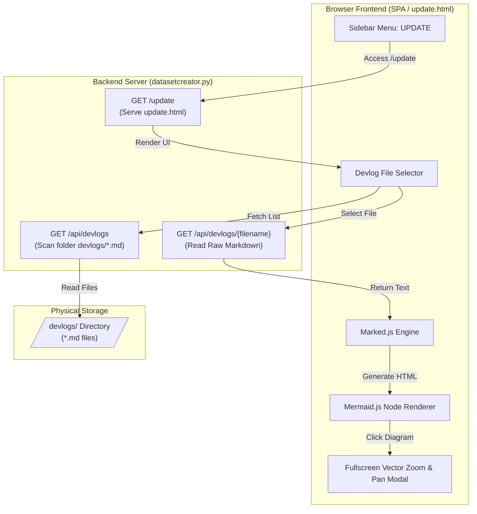
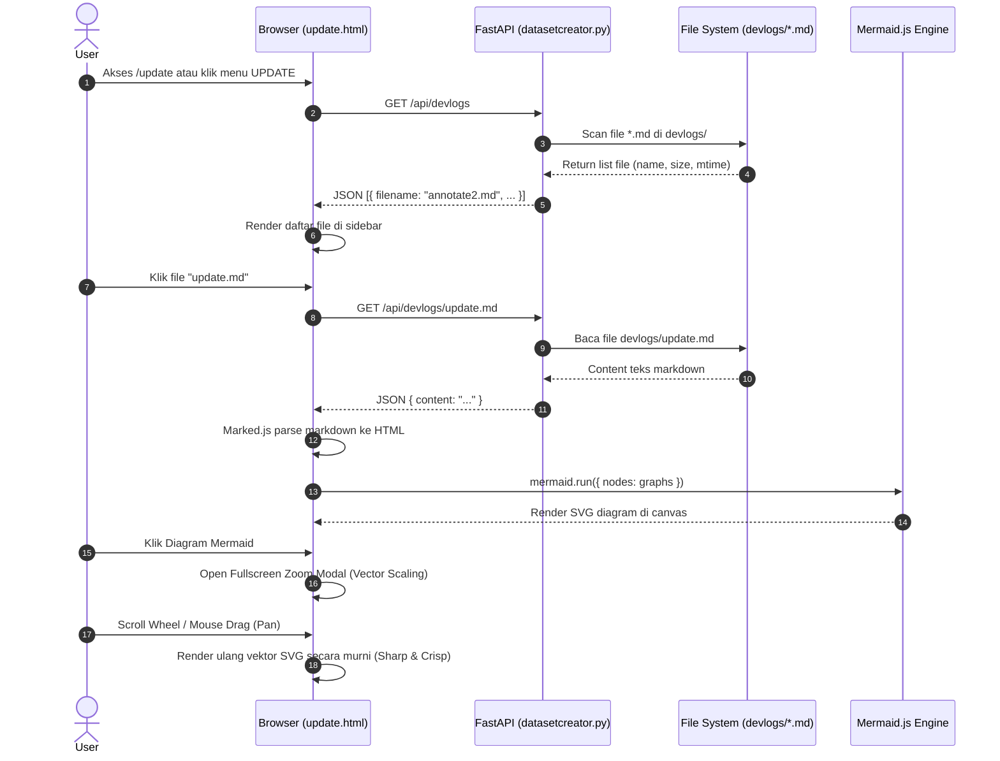

# System Update & Devlog Documentation Viewer (`/update`)

Dokumen ini menjelaskan spesifikasi teknis, arsitektur, dan alur kerja dari modul **Devlog Viewer & System Update (`/update`)** pada aplikasi Vehicle Detection Dataset Manager.

---

## 🏛️ 1. Ringkasan Fitur `/update`

- **GitHub Dark Mode UI**: Tampilan antarmuka bergaya GitHub Dark Theme (`#0d1117`, `#161b22`, `#30363d`) dengan sidebar navigasi untuk menjelajahi file dokumentasi `.md` di folder `devlogs/`.
- **Dynamic File Loader**: Membaca secara otomatis seluruh dokumen `.md` yang ada di direktori `devlogs/` tanpa perlu mendaftarkannya secara manual.
- **Client-Side Markdown Rendering**: Menggunakan **Marked.js** untuk memproses sintaks Markdown secara lengkap (headers, tables, code blocks, callouts, badges).
- **Interactive Mermaid Node Renderer**: Mengidentifikasi blok kode ` ```mermaid ` dan merender diagram graf/flowchart secara otomatis menggunakan **Mermaid.js**.
- **Vector High-Resolution Zoom & Pan Modal**: Modal zoom *fullscreen* interaktif dengan perenderan vektor langsung (sharp text/lines 100% tanpa pixelation/blur), dukungan scroll wheel zoom, drag pan 60 FPS, serta tombol reset/close (`Esc`).

---

## 📊 2. Diagram Alur Sistem (Flowchart)



---

## 🔄 3. Diagram Sekuensial Eksekusi (Sequence Diagram)



---

## ⚡ 4. Detail Teknis Penanganan Zoom Vektor Tajam (Sharp Vector Fix)

Untuk mencegah gambar diagram menjadi buram/pixelated saat diperbesar (yang biasa terjadi jika memperbesar grafik dengan CSS `transform: scale()` pada elemen berukuran kecil):
1. **Atribut Dimensi SVG**: Atribut `width` dan `height` bawaan SVG dihapus sehingga SVG dapat mengekspansi resolusi vektor secara murni berdasarkan `viewBox`.
2. **Skala Dimensi Vektor Langsung**: Skala zoom diterapkan langsung pada dimensi `svg.style.width` dan `svg.style.height` (misal `baseWidth * zoomScale`).
3. **Pergerakan 60 FPS Smooth**: Efek geser (pan) menggunakan `translate3d(x, y, 0)` tanpa animasi CSS transition yang bertabrakan, menghasilkan pergerakan murni 1-to-1 yang sangat halus tanpa jitter.
